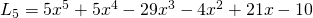
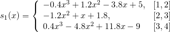

# Interpolation

## Classes

You are provided with the following classes:

### Interpolating Polynomials
- *InterpolatingPolynomial* - a base class that provides methods that do not require generation of a polynomial.
- *NewtonInterpolatingPolynomial* - a class that is able to generate an IP using Netwon method of interpolation.
- *LagrangeInterpolatingPolynomial* - a class that is able to generate an IP using Lagrange method of interpolation.

### Splines
- *InterpolatingSpline* - a base class that provides methods that do not require generation of a spline.
- *LinearInterpolatingSpline* - a class that generates a linear interpolating spline.
- *SquareInterpolatingSpline* - a class that generates a square interpolating spline.
- *CubicInterpolatingSpline* - a class that generates a cubic interpolating spline.

### Utility
- *NewtonDifferences* - a class that calculates Newton Differences used in Netwon Interpolating Polynomial and Square Interpolating Spline genertion methods.

## Code Snippets / Excercises

### Excercise

>Given the following data pairs (0, 0), (1, 1), (2, 8), (4, 64), (5, 125) find linear,
>square and cubic interpolating polynomials and find their value at x = 2.
>
>Measure the error made for each degree of interpolating polynomial.


#### Code
```python
import sympy as sym
from numericalmethods import Interpolation

x = sym.Symbol('x')

x_values = [0, 1, 2, 4, 5]
y_values = [0, 1, 8, 64, 125]
at_x = 3

nip = Interpolation.NewtonInterpolatingPolynomial(x_values, y_values, x)

print(f'L1({at_x}): {nip.polynomial(1, offset=2).subs(x, at_x)}')
print(f'Error of L1({at_x}): {nip.practical_error_next_degree(1, offset=2).subs(x, at_x)}')

print(f'L2({at_x}): {nip.polynomial(2, offset=1).subs(x, at_x)}')
print(f'Error of L2({at_x}): {nip.practical_error_next_degree(2, offset=1).subs(x, at_x)}')

print(f'L3({at_x}): {nip.polynomial(3, offset=0).subs(x, at_x)}')
print(f'Error of L3({at_x}): {nip.practical_error_next_degree(3, offset=0).subs(x, at_x)}')
```
#### Results
```
L1(3): 36.0000000000000
Error of L1(3): 11.0000000000000
L2(3): 29.0000000000000
Error of L2(3): 2.00000000000000
L3(3): 27.0000000000000
Error of L3(3): 
```

#### Caveats

*Symbolic Expressions*

Calling `polynomial(degree)` and `practical_error_next_degree(degree)` returns a symbolic expression.
e.g. in the prior excercise:
```python
>>> nip.polynomial(1)
1.0*x
>>> nip.polynomial(2)
3.0*x*(x - 1) + 1.0*x
>>> nip.polynomial(3)
1.0*x*(x - 2)*(x - 1) + 3.0*x*(x - 1) + 1.0*x
```

As such, you have to call the SymPy function [subs(symbol, value)](https://docs.sympy.org/latest/tutorial/basic_operations.html#substitution), which replaces the provided symbol, with the provided value. 

*Practical Error*

If you do not have the original function to measure the error, you can use practical error evaluation.
Base Interpolation class provides a function ```practical_error_polynomial_difference(degree)``` which can be used interchangebly by both Netwon and Lagrange interpolation classes.

When ```practical_error_next_degree(degree, newton_differences)``` is used with Newton IP, you do not have to specify *newton_differences* parameter, as the class passes that parameter by itself. 

When ```practical_error_next_degree(degree, newton_differences)``` is used with Lagrange IP, you do have to specify *newton_differences* parameter. Simply create the NewtonDifferences class with the data and pass it through to the method.

*Offset*

In this case, the offset is required for both linear and square IP. By default the offset is 0 and the IP is generated from the first values.

As the excercise asks you to calculate the value ```f(3)```, for example, with default offset of 0, for square IP the points ```(0, 0), (1, 1), (2, 8)``` are used and the value 3 does not appear in the interval of (0, 2). Setting the offset to 1 or 2 would use the points ```(1, 1), (2, 8), (4, 64)``` and ```(2, 8), (4, 64), (5, 125)``` respectively. 


### Excercise

>Given the following polynomial 
>determine if it fits the following data set:
> 
> (-2, 84), (-1, -6), (0, -10), (1, -12), (2, 24), (5, 15120)

#### Code
```python
import sympy as sym
from numericalmethods import Interpolation

x = sym.Symbol('x')

L5 = 5*x**5 + 5*x**4 - 29*x**3 - 4*x**2 + 21*x - 10

x_values = [-2, -1, 0, 1, 2, 5]
y_values = [84, -6, -10, -12, 24, 15120]

fits = Interpolation.InterpolatingPolynomial(x_values, y_values, x).fit(L5)
print(f"Polynomial {L5} {'fits' if fits else 'does not fit'} the data.")
```
#### Results
```
Polynomial 5*x**5 + 5*x**4 - 29*x**3 - 4*x**2 + 21*x - 10 fits the data.
```

### Excercise
>Given the following piecewise functions determine if they are splines, and if so, of which degree.
> 
> 
> 
#### Code
```python
import sympy as sym
from numericalmethods import Interpolation

x = sym.Symbol('x')

def pp_spine(is_spline, degree):
    return f'is a spline of degree {degree}.' if is_spline else 'is not a spline.'

functions = [
    4*x**2 + 2,
    3*x + 10,
    x - 1
]
points = [0, 1, 4, 7]
is_spline, degree = Interpolation.InterpolatingSpline.is_spline(functions, points, x)
print(f"s0 {pp_spine(is_spline, degree)}")


functions = [
    -0.4*x**3 + 1.2*x**2 - 3.8*x + 5,
    -1.2*x**2 + x + 1.8,
    0.4*x**3 - 4.8*x**2 + 11.8*x - 9
]
points = [1, 2, 3, 4]
is_spline, degree = Interpolation.InterpolatingSpline.is_spline(functions, points, x)
print(f"s1 {pp_spine(is_spline, degree)}")
```
#### Results
```
s0 is not a spline.
s1 is a spline of degree 3.
```